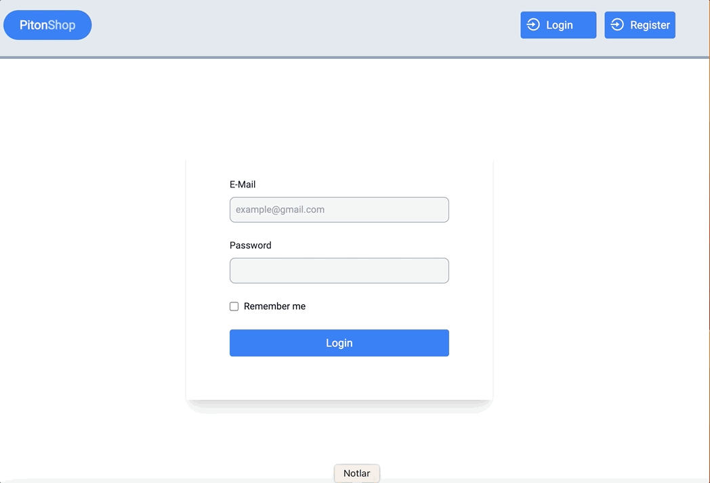

### 🚩DESCRIPTION

🔓 Login Pages:

Email and password are validated on the login page. When the user logs in, they are directed to the product page.

📖 Product Page:

Our products are listed on the products page and when the product is clicked, the detail page opens.
💗 Like button is used to select/remove favorite products.

🔍 Register pages

### 🚩 PROJECT STRUCTURE

```js
├── components
│   ├── Like.tsx
│   └── Navbar.tsx
├── next.config.js
├── package-lock.json
├── package.json
├── pages
│   ├── _app.tsx
│   ├── _document.tsx
│   ├── api
│   │   └── hello.ts
│   ├── index.tsx
│   ├── login.tsx
│   ├── products
│   │   └── [id].tsx
│   ├── products.tsx
│   └── register.tsx
├── postcss.config.js
├── public
│   ├── piton.ico
│   └── piton.jpg
├── store
│   ├── product.tsx
│   └── store.tsx
├── styles
│   ├── Home.module.css
│   └── globals.css
├── tailwind.config.js
├── tsconfig.json

```

### 🚩 Libraries and Technologies I use

- Next.js
- TypeScript
- Toastify
- Tailwindcss
- Redux
- Redux Toolkit
- React Hook Form
- React-Phone-Number
- Formik-Yup


### 🚩 How does my project look

<p align="left">
  
  
</p>


### 🚩 How To Use

To clone and run this application, you'll need Git
```
# Clone this repository ($ git clone https://github.com/......)

   - Run the following command to install the required dependencies of the project

>> npm install [This command downloads all the dependencies in the project's package.json file and creates the necessary files to run the project.]

   - Run the following command to compile Typescript files:
>> npm run build [This command compiles all Typescript files in the project and converts them to JavaScript files.]
>> npm run start
>> Open the runserver
```